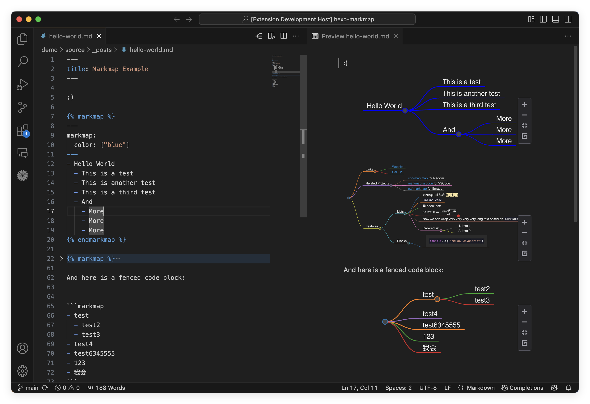

# VS Code Markmap Universe

[](https://marketplace.visualstudio.com/items?itemName=maxchang.vscode-markmap-universe) 
[](https://marketplace.visualstudio.com/items?itemName=maxchang.vscode-markmap-universe) 
[](https://open-vsx.org/extension/maxchang/vscode-markmap-universe)
[](https://open-vsx.org/extension/maxchang/vscode-markmap-universe)
[](README.zh_CN.md)

在 VS Code 内置的 Markdown 预览中使用 markmap 创建可交互的思维导图，无缝支持 `hexo-markmap` 标签和 `markmap` 代码块两种语法。

## 功能特性

- **实时 Markmap 预览**
- **支持 `hexo-markmap` 标签**：  
  - 识别 `...` 语法。  
  - 为 `hexo-markmap` 标签提供折叠功能。 
- **支持代码块**：  
  - 渲染带有 `markmap` 标识符的代码块。  
- **可自定义预览**：  
  - 通过 frontmatter 调整样式和选项。  
  - 兼容 [remark-markmap](https://github.com/markmap-universe/remark-markmap#frontmatter-options) 和 [hexo-markmap](https://github.com/markmap-universe/hexo-markmap#options)。  
- **语法高亮**：
  - 高亮显示 Markmap frontmatter 和 Markdown 内容。




## 使用方法

在 Markdown 文件中，你可以使用 `hexo-markmap` 标签或 `markmap` 代码块来创建思维导图。当预览打开时，插件会自动渲染这些内容。

### `hexo-markmap` 标签

```markdown

---
markmap:
  colorFreezeLevel: 2
---
# Markdown
# 语法

```

### 代码块

````markdown
```markmap
---
markmap:
  colorFreezeLevel: 2
---
# Markdown
# 语法
```
````

### 行内配置

你可以在 `markmap` 标签中单独自定义每个思维导图。

#### Frontmatter 选项

在 Markmap 中，你可以通过 frontmatter 来配置思维导图的样式和选项。所有 frontmatter 选项都是可选的。

- **`id`**：用于定义 `markmap-wrap` 元素的 ID。  

- **`markmap`**：对应 markmap 项目中的 [`IMarkmapJSONOptions`](https://markmap.js.org/api/interfaces/markmap-view.IMarkmapJSONOptions.html)。有关更多详细信息，请参考 [`jsonOptions`](https://markmap.js.org/docs/json-options#option-list)。

#### `hexo-markmap` 标签选项

对于 `hexo-markmap` 标签，你可以直接在标签中指定思维导图的高度，默认情况下会根据内容进行计算。

```markdown

# Markdown
# 语法

```

### 插件配置

**`markmap-universe.globalOptions`**
  - **类型**：`object`：所有思维导图的全局选项。对应 [`Frontmatter 选项`](#frontmatter-选项) 中的 `markmap`。
  - **默认值**：`{}`

**`markmap-universe.toolbar`**
  - **类型**：`boolean`: 显示工具栏。
  - **默认值**：`true`

## 感谢

参考了以下项目：

- [vscode-markdown-markmap](https://github.com/phoihos/vscode-markdown-markmap)
- [markmap-vscode](https://github.com/markmap/markmap-vscode/)
